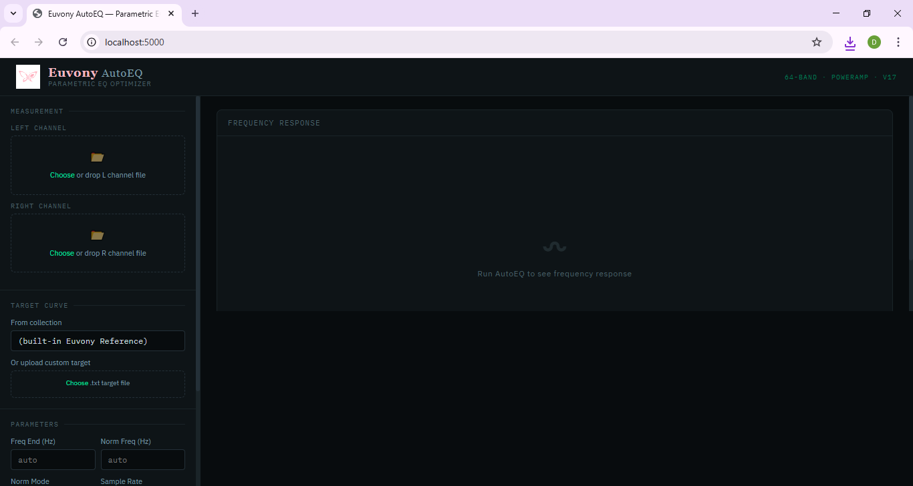
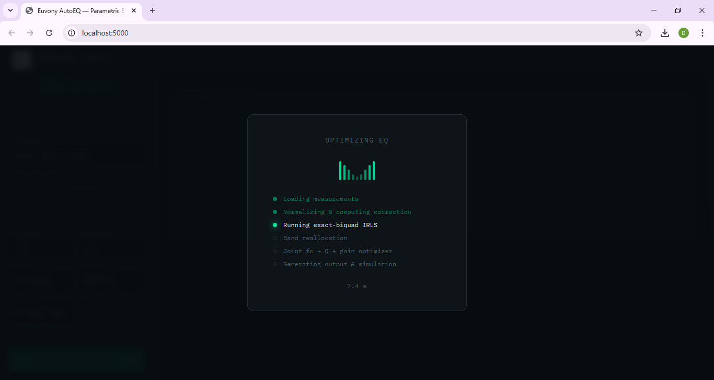
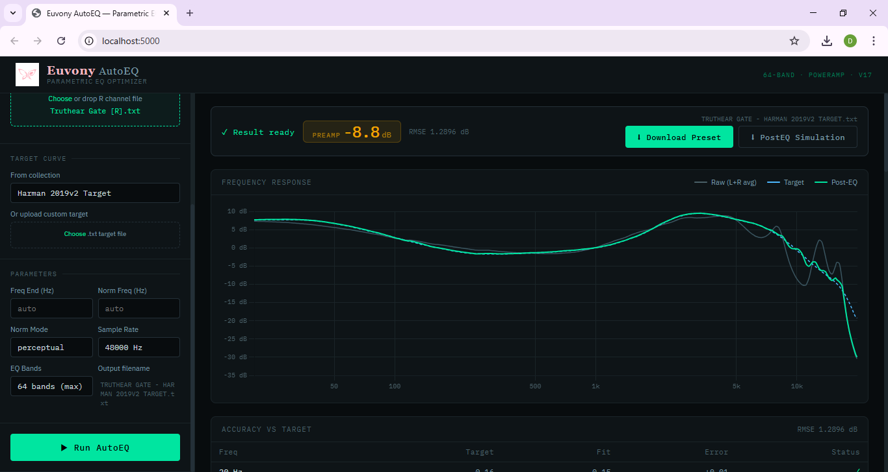
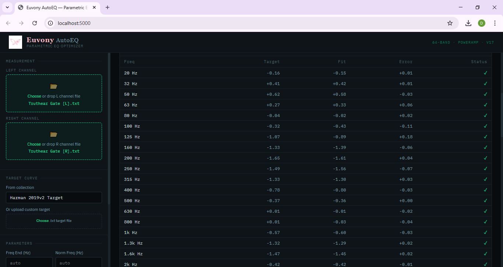
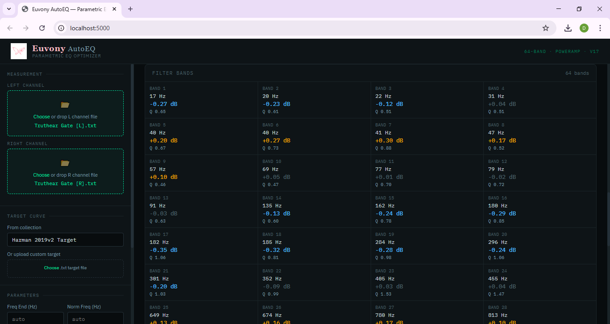

# AutoEQ — 8–128 band Parametric EQ Optimizer

A psychoacoustic-aware IEM correction engine with exact biquad modeling.  
Takes stereo L/R measurements and a target curve, outputs optimized parametric EQ presets.

> **Platform:** Python on PC (web interface). Primary output: Poweramp 8–128 band PEQ (Android).

---

## Features

- **8–128 band parametric EQ** output with exact biquad filter modeling
- **Web-based GUI** — runs in your browser, no terminal needed
- **Auto file detection** — drop your measurement files and run
- **Auto normalization** — finds the flattest region between 500–800 Hz automatically
- **Auto freq-end detection** — detects usable upper limit from measurement rolloff
- **Auto output naming** — output file named from your IEM + target automatically
- **EQ Bands selector** — choose 8 / 10 / 16 / 32 / 64 / 128 bands
- **Psychoacoustic optimization** — perceptual weighting, Huber robust loss, multi-resolution IRLS
- **Exact biquad pipeline** — no filter shape approximations
- **Post-EQ simulation** — always generated; upload `*_PostEQ.txt` to Squiglink to verify visually
- **ZIP output** — downloads `result.txt` (clean preset), `report.txt` (full metadata + accuracy), and `PostEQ.txt` in one file
- **Built-in target** — Euvony Reference (neutral-bright-airy)

---

## Requirements

```
Python 3.8+
numpy
scipy
tqdm  (optional)
flask
```

> `run.bat` installs Flask automatically on first launch. For numpy/scipy/tqdm, run once:

```bash
pip install numpy scipy tqdm
```

---

## Quick Start

**1. Clone or download this repo**

**2. Place your measurement files in the `Measurement/` folder**

Files must be named with `[L]` / `[R]` or `_L` / `_R` in the filename.  
Example: `KZ Taurus [L].txt` and `KZ Taurus [R].txt`

**3. Double-click `gui/run.bat`**

Browser opens automatically at `localhost:5000`. That's it.

---

## Using the Interface



**Left panel — Input:**
- Upload your **L** and **R** measurement files (`.txt` or `.csv`)
- Pick a **target curve** from the dropdown, or upload a custom one
- Set optional parameters: Freq End, Norm Freq, Norm Mode, Sample Rate, EQ Bands

**Click Run**



A loading overlay appears with a live progress indicator and elapsed timer.

**Right panel — Results:**



- **Preamp value** — displayed prominently in amber. Set this in Poweramp first.
- **RMSE** — how closely the EQ matches the target
- **Download All (ZIP)** — downloads 3 files: clean preset, full report, and PostEQ simulation
- **Frequency Response chart** — Raw L+R avg (grey), Target (blue dashed), Post-EQ (green)



- **Accuracy vs Target table** — per-octave error, color-coded ✓ / ⚠ / ✗



- **Filter Bands** — all band values ready to enter into Poweramp (up to 128)

---

## Output Files

Each run produces 3 files, bundled into a ZIP:

| File | Contents |
|---|---|
| `IEM - TARGET.txt` | Clean preset — Preamp + Filter lines only, no comments |
| `IEM - TARGET_report.txt` | Full report — optimizer metadata, RMSE, accuracy table, annotated PEQ |
| `IEM - TARGET_PostEQ.txt` | Post-EQ simulation — upload to [squig.link](https://squig.link) to verify visually |

---

## How to Import into Poweramp

> Output file format is compatible with **Poweramp** on Android. Poweramp supports direct import of parametric EQ preset files — no manual band entry needed.

1. Download the ZIP and extract `IEM - TARGET.txt`
2. Move the file to your phone storage
3. Open Poweramp → three-dot menu → **Equalizer** → **Presets** → **Import**
4. Select the `.txt` file — all bands load automatically (up to 128)
5. Set **Preamp** to the value shown in the preset — **mandatory, do this first**

> ⚠️ Always set Preamp first. Without it, boost filters will cause digital clipping.

---

## Included Targets

All targets are in the `targets/` folder.

| File | Character |
|---|---|
| `Euvony Personal Target.txt` | Neutral-bright-airy. Vocal-forward with extended treble, sub-bass shelf, analytical detail retrieval |
| `Harman 2019v2 Target.txt` | Consumer-tuned. Elevated bass shelf, warm mids, widely used reference |
| `IEF Neutral 2020 Target.txt` | Crinacle's original neutral reference. Flat-leaning, less bass than Harman, clinical |
| `IEF Neutral 2023 Target.txt` | Updated IEF Neutral. Added lower-mid weight, reduced 1–2kHz honkiness, more natural timbre |
| `#U0394 IEF Preference 2025 Target.txt` | Crinacle's preference curve, not neutrality target. PopAvg-DF (JM-1) base with +10dB bass shelf and -4dB treble shelf. Speaker-like, engaging |
| `#U0394 5128 DF (Tilt_ -1dB_Oct) Target.txt` | B&K 5128 diffuse field with -1dB/oct tilt. Reference-grade, slightly warm |
| `#U0394 JM-1 DF (Tilt_ -1dB_Oct) Target.txt` | JM-1 diffuse field with -1dB/oct tilt. Neutral baseline, flatter than IEF Preference |

---

## Built-in Target: Euvony Reference

The default target when no custom target is selected.

**Character:** Neutral · Bright · Airy

- **20–100 Hz** — gentle sub-bass shelf, not bass-boosted
- **150–400 Hz** — female chest voice body, elevated for vocal weight
- **500 Hz** — slight dip to reduce IEM boxiness
- **1–2 kHz** — natural presence, no honk
- **2.5–3 kHz** — presence peak, singer's formant region
- **4–10 kHz** — maintained for clarity, transient precision, and air
- **10–16 kHz** — extended treble rise for airy quality before steep rolloff

Compared to references:
- vs **Harman**: less bass, brighter presence, much more treble extension
- vs **IEF Neutral 2023**: more vocal body at 200–400 Hz, higher presence peak, more air above 8kHz
- vs **IEF Preference 2025**: less bass emphasis, more analytical, brighter overall

---

## Input File Format

```
# Comments start with #
20.0,96.80
20.3,96.78
...
20000.0,65.12
```

Supported separators: comma or tab.  
AutoEQ CSV format (`frequency,raw,smoothed`) is also supported — `raw` column is used.

---

## Normalization

All input files (L, R, target) must be on the same absolute dB scale.

**Recommended — Squiglink:**  
Upload to [squig.link](https://squig.link) → `Normalize → 60 dB → 500 Hz → Download`

---

## Algorithm Overview

**Optimization stages:**
1. Gauss-Newton warm start with Jacobian column normalization
2. 2-pass IRLS with Huber robust loss and multi-resolution residual decomposition
3. Adaptive band reallocation (iterative greedy, up to 4 passes)
4. Joint fc+Q+gain optimizer (L-BFGS-B with residual-aware importance sampling)
5. Post-joint reallocation check

**Regularization:** Ridge · Smoothness (1st + 3rd derivative) · Band energy · Q penalty · Perceptual pole radius · HF proximity · Phase slope

**Psychoacoustic features:** Perceptual weighting · A-weighting masking · ERB-based min-phase blend · Adaptive σ frequency jitter · Multi-resolution IRLS

---

## Measurement Sources

- [squig.link](https://squig.link) — community database aggregator
- [crinacle.com](https://crinacle.com) — EARS + 711 measurements
- [graph.hangout.audio](https://graph.hangout.audio)

---

## License

MIT — see [LICENSE](LICENSE)

---

## Author

**DAPAAADF** (Euvony)  
github.com/DAPAAADF
